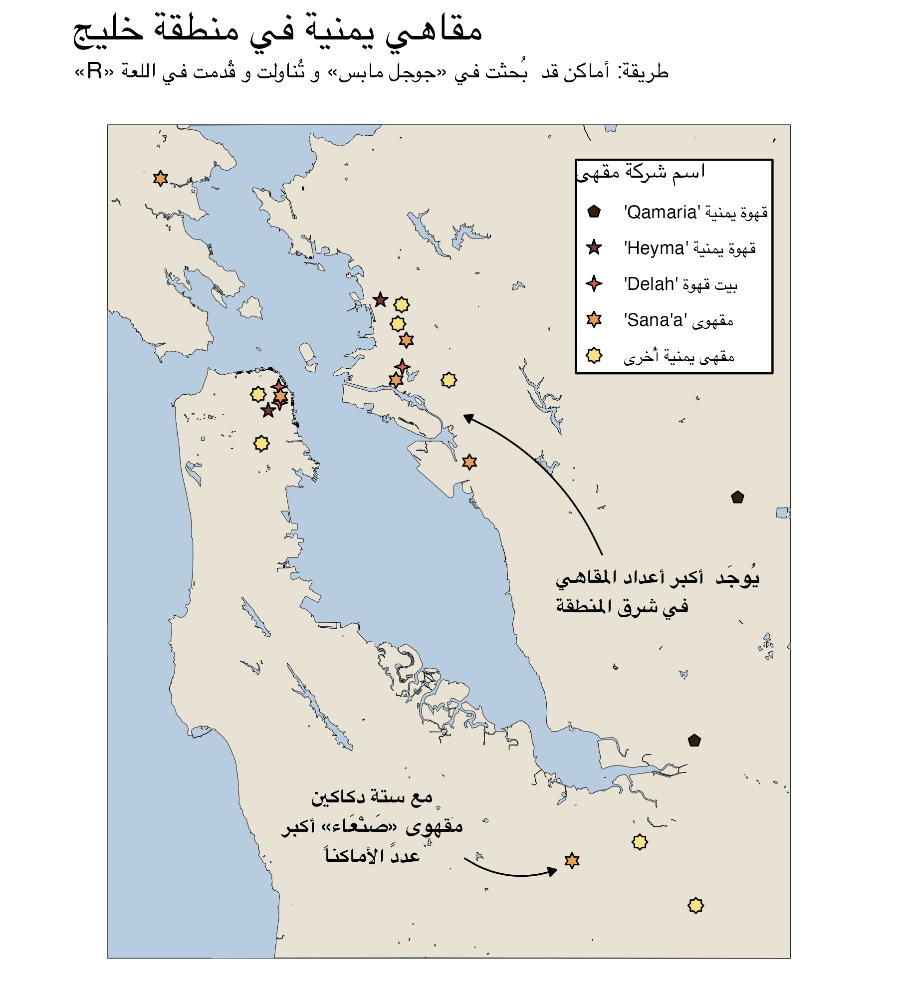

# Yemeni coffe shops in the Bay Area // مقاهي يمنية في منطقة خليج

Data visualisation as part of final project in Arabic 20B class at UC Berkeley.

Location data of cafes were retrieved from Google Maps using Claude Sonnet. Coastline is taken from https://opendata.mtc.ca.gov/datasets/san-francisco-bay-region-water-area/

